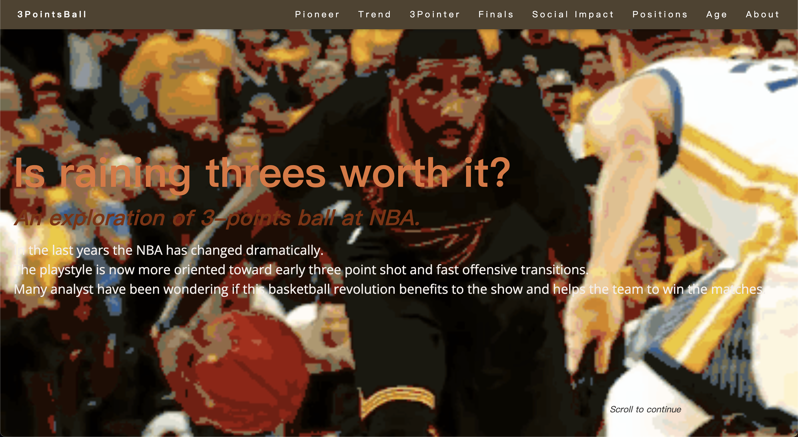
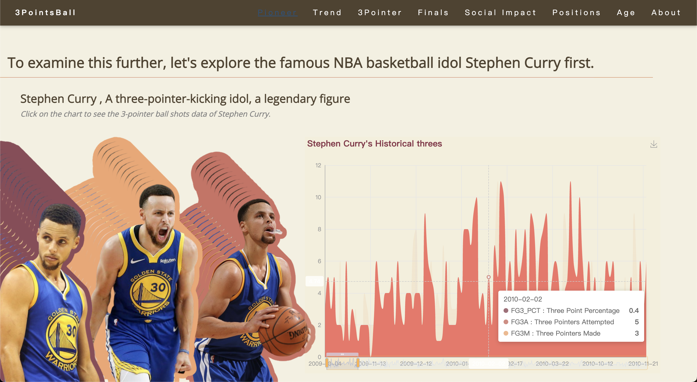
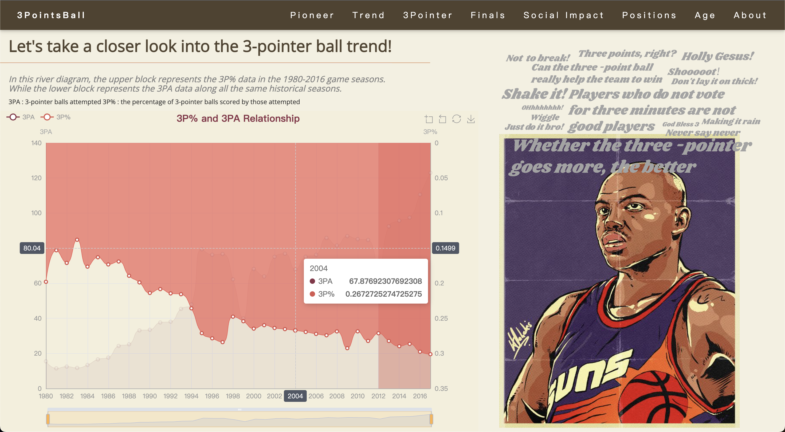
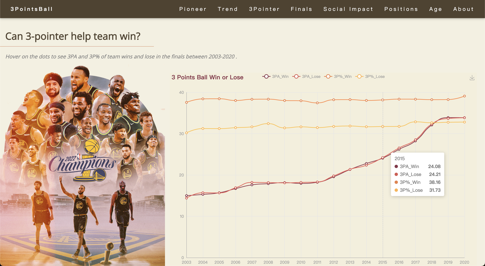
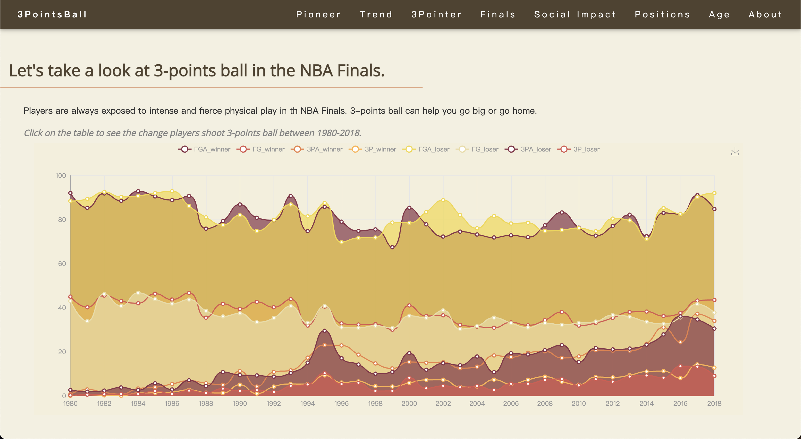
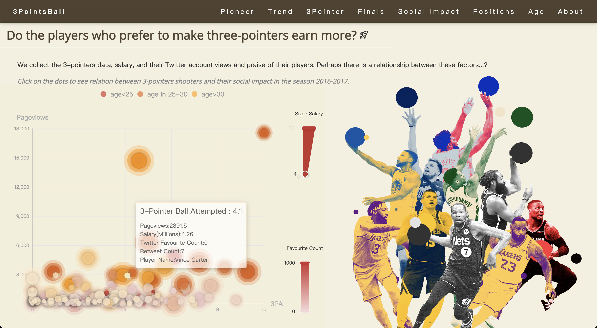
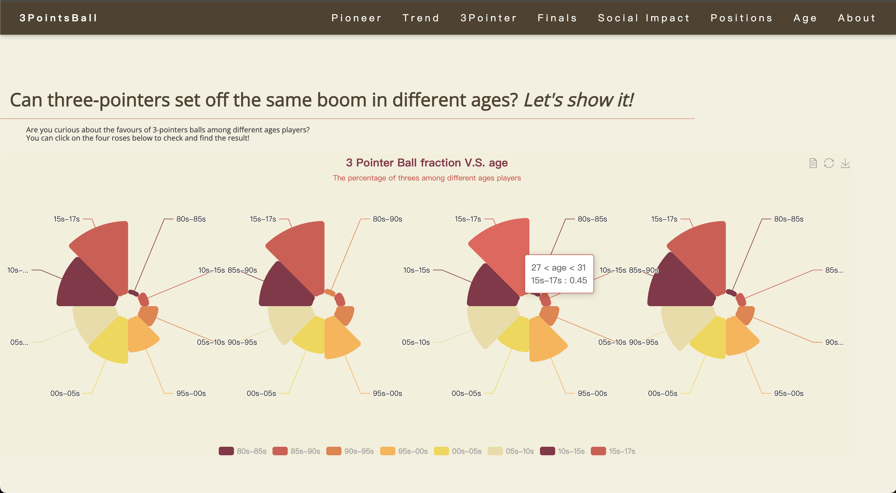

# visualization-final-project
 Final Project for ZJU Data Visualization course`Is raining three worth it?`

To view the project directly, you can click this [website Link](https://carton22.github.io/)

More information please refer to [our Feishu document](https://k5ms77k0o1.feishu.cn/docx/IWxjdOCOho0tH4x37DRcrtUZnSh)

We also make an online video on [Bilibili](https://www.bilibili.com/video/BV1kY411U7dA/?spm_id_from=888.80997.embed_other.whitelist&vd_source=7ff5f4619b1b3fd1968acaf4df46e2eb)  and [Youtube](https://youtu.be/NbTH5gKljwE)😄

## Quick Page Browse

